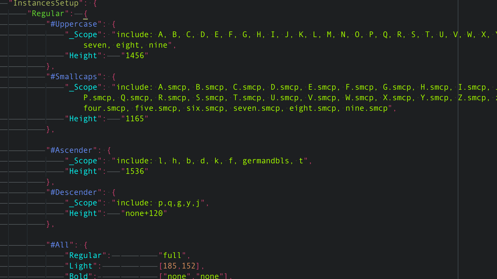

# RobotoFlex
- demo to test the capabilities of the new fontformat
- work in progress

Preview in [Fontview](https://github.com/googlei18n/fontview/releases):

### Features currently missing in the font format (for this project)
- per-glyph-interpolation axes (the “Height”-subaxes are currently achieved by a workaround)
- math for the slider behaviour to increase usability (e.g. to make the faux-mono-axis a child of the mono-axis, to prevent strange results if both are applied) 

---
## Drawing
### Files
- RobotoFlex.glyphs
- RobotoFlex_multipolation-spec.json (own designspace format)
- Multipolation.min.py (need to be installted to handle the designspace format)
		
### Multipolation-Space (Design-Space)
**Master-Setup**
- setting up relations and custom scales (also allows different x/y-values)

**Instance-Setup**
- specifying Instances
- set up different values for SmallCaps, ...  (“local interpolations”)

**How to create instances in Glyphs**
1. Move Multipolation.min.py to the Glyphs script folder
2. Open the Glyphs-file 
3. Execute the script (Script > Multipolation).

---
## Building Variable Font
Direct export is not yet supported, therefore the following workaround.

### Files
- build.sh
- RobotoFlex.designspace
- [master_ttf_interpolatable] (gets generated by build.sh)
- stat.ttx (not necessarily needed, I think)

### Build
1. Export UFOs (“RoundedCorners” and “Tight” needs to be generated from instances)
2. manually update the values in the .designspace (if needed)
3. Install [Fontmake](https://github.com/googlei18n/fontmake) (if not already installed)
4. execute the build.sh file via Terminal ([instructions](https://apple.stackexchange.com/questions/235128/how-do-i-run-a-sh-or-command-file-in-terminal))
5. Cross fingers and enjoy

If it did not work have a look over here: https://github.com/scribbletone/i-can-variable-font)
